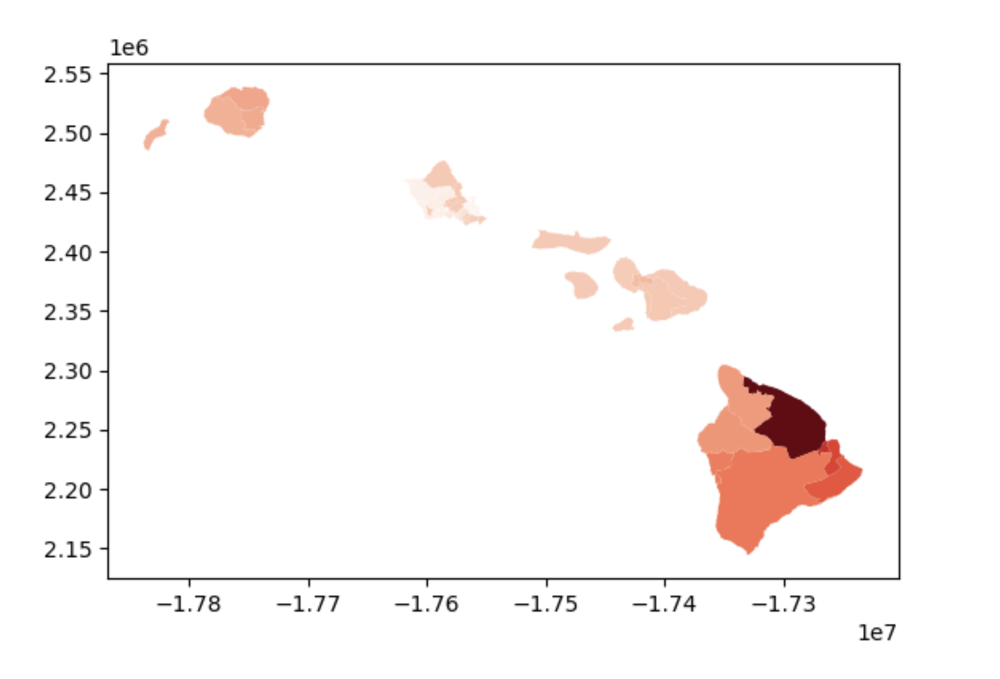
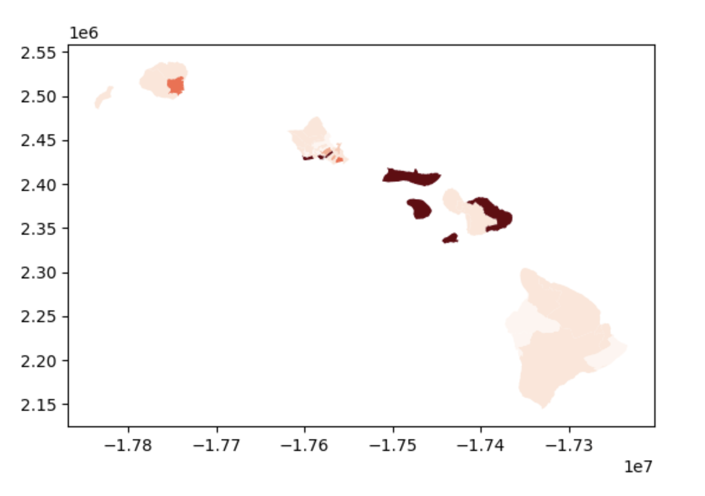

# Hawaii Heat Map Project

Welcome! This project aims to visualize which housing districts of Hawaii experience the most earthquakes and wildfires as a set of heatmaps. They are displayed on a react page that refreshes in 30 seconds intervals to account for new data. This data can be viewed in the Datasets folder.

Earthquakes:

Wildfires:

## Setup

1. Run `python -m venv venv` to create a virtual environment
2. `pip install -r requirements.txt` to install the dependencies

## Generate the map

1. `uvicorn main:app --reload` to run the fastAPI server
2. `cd my-app` and then: ``npm install`` to install the dependencies `npm start` to run the react page

If you do not have npm installed, see the below link (for windows):
https://www.freecodecamp.org/news/how-to-install-node-js-and-npm-on-windows-2/

If you experience the following error (on MacOS):
pyspark.errors.exceptions.base.PySparkRuntimeError: [JAVA_GATEWAY_EXITED] Java gateway process exited before sending its port number.
Run:
`brew install java`
Then link it with the following:
`sudo ln -sfn /opt/homebrew/opt/openjdk/libexec/openjdk.jdk \
 /Library/Java/JavaVirtualMachines/openjdk.jdk`

Datasets:
 
Earthquake Data: https://www.usgs.gov/programs/earthquake-hazards
 
Wildfire Data: https://pacificfireexchange.org/resource/fire-data/
